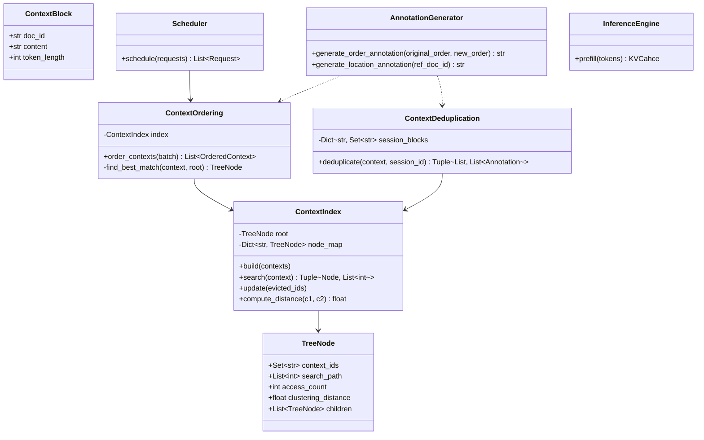
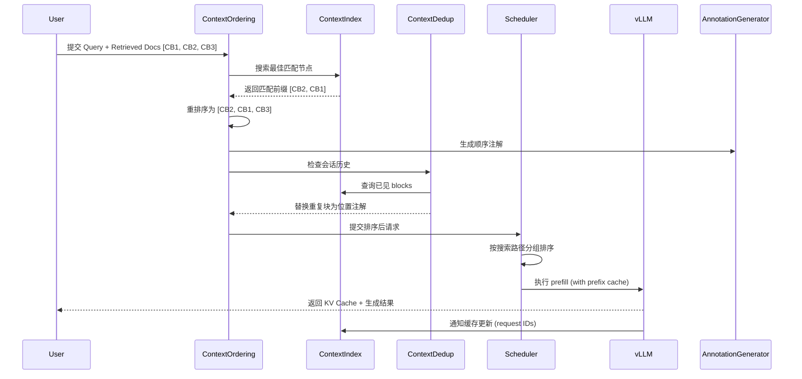
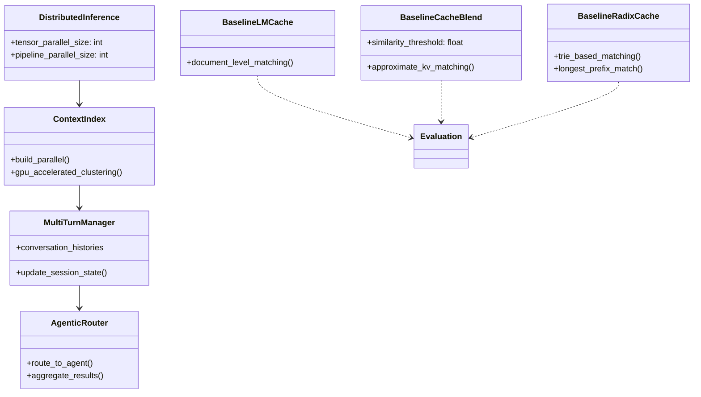
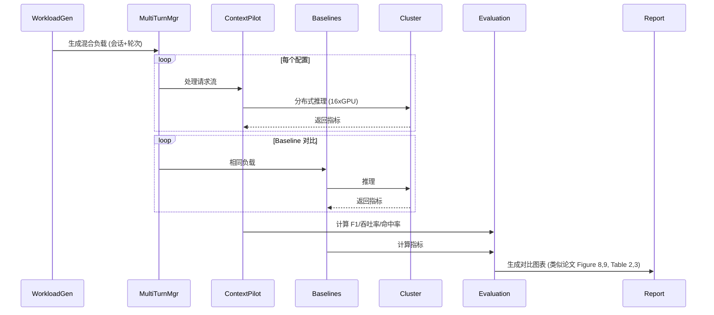

# 复现计划: ContextPilot: Fast Long-Context Inference via Context Reuse

## 计划概览

本文档包含两套复现计划：
- **Part A: MVP 计划** — 最小可运行版，快速验证核心方法
- **Part B: 完整计划** — 完整复现论文所有实验结果

**切分依据**: 
- **MVP** 选择 MultihopRAG 数据集（单会话RAG，数据相对容易获取）和 Qwen3-4B-Instruct 模型（最小规模，单GPU可运行），仅实现核心 Trio：Context Index + Ordering + De-duplication，验证 F1 和吞吐率提升。
- **Full** 添加多轮对话（MT-RAG）、Agentic场景（Chain-of-Agent, Mem0）、所有基线对比（LMCache, CacheBlend, RadixCache）、多GPU大规模实验（DeepSeek-R1）及消融实验。

| 层级 | 复现难度 (1-5) |
|------|---------------|
| MVP  | 2.8           |
| Full | 4.2           |

---

# Part A: MVP 计划 (最小可运行版)

## 1. 执行摘要

**论文贡献**: ContextPilot 通过上下文复用加速长上下文推理的 prefill 阶段，核心创新包括：(1) 基于层级聚类的上下文索引，(2) 最大化前缀缓存命中的上下文重排序，(3) 多轮对话中的去重机制，(4) 保持精度的轻量注解。

**复现复杂度**: 中等。核心算法（索引构建、距离计算、搜索、调度）在论文中有伪代码描述，但需与现有推理引擎（vLLM/SGLang）集成。数据预处理逻辑明确，无需训练模型。

**实现策略**: 
1. 基于 PyTorch + Transformers 构建独立上下文处理模块（不修改底层 CUDA kernel）
2. 使用 HuggingFace 数据集加载 MultihopRAG
3. 实现层级聚类索引和距离函数（Equation 1）
4. 与 vLLM 集成进行端到端吞吐率测试

**整体复现难度**: 2.8/5

## 2. 架构概览

### 2.1 模块结构



### 2.2 执行流程



### 2.3 模块详情

#### ContextIndex
- **文件**: `src/context_index.py`
- **描述**: 管理上下文块的层级聚类索引，支持快速前缀匹配和会话遍历
- **依赖**: ContextBlock, TreeNode
- **接口**:
  ```python
  class ContextIndex:
      def __init__(self, alpha: float = 0.001):
          self.alpha = alpha
          
      def build(self, contexts: List[List[str]]) -> None:
          """层级聚类构建索引 (Algorithm 4)"""
          
      def search(self, context: List[str]) -> Tuple[TreeNode, List[int]]:
          """树搜索返回最佳匹配节点和路径 (Algorithm 1)"""
          
      def compute_distance(self, c1: List[str], c2: List[str]) -> float:
          """基于重叠率和位置对齐的距离 (Equation 1)"""
  ```
- **实现要点**:
  - 距离函数实现: $d_{ij} = 1 - \frac{|S_{ij}|}{\max(|C_i|, |C_j|)} + \alpha \cdot \frac{\sum_{k \in S_{ij}}|p_i(k) - p_j(k)|}{|S_{ij}|}$
  - 层级聚类: 先计算所有 pairwise 距离，然后迭代合并最近对
  - 树节点存储: context block IDs, search path, access frequency

#### ContextOrdering
- **文件**: `src/ordering.py`
- **描述**: 基于索引的上下文重排序算法，最大化前缀共享
- **依赖**: ContextIndex
- **接口**:
  ```python
  class ContextOrdering:
      def order_contexts(self, batch: List[List[str]]) -> List[OrderedContext]:
          """对批次请求进行重排序 (Algorithm 2)"""
          
      def find_best_match_node(self, context: List[str], root: TreeNode) -> Optional[TreeNode]:
          """寻找最佳匹配节点"""
  ```
- **实现要点**:
  - 对每个新上下文执行树搜索 (Algorithm 1)
  - 将匹配前缀置于前面，剩余 blocks 保持原序
  - 若为新会话，继承父节点前缀

#### ContextDeduplication
- **文件**: `src/deduplication.py`
- **描述**: 多轮对话中的上下文去重，用位置注解替换重复块
- **依赖**: ContextIndex
- **接口**:
  ```python
  class ContextDeduplication:
      def __init__(self, index: ContextIndex):
          self.seen_blocks = {}  # session_id -> Set[doc_id]
          
      def deduplicate(self, new_context: List[str], session_id: str) -> Tuple[List[str], List[str]]:
          """去重并生成位置注解 (Algorithm 3)"""
  ```
- **实现要点**:
  - 维护每个会话的已见 blocks 集合
  - 对新上下文中的每个 block，若已存在则替换为 "refer to [doc_id] in previous conversation"
  - 更新已见集合供未来轮次使用

#### AnnotationGenerator
- **文件**: `src/annotation.py`
- **描述**: 生成保持原始相关性语义的轻量注解
- **接口**:
  ```python
  class AnnotationGenerator:
      def generate_order_annotation(self, original_order: List[str], new_order: List[str]) -> str:
          """生成顺序注解，如 'Please read in priority order: Doc2 > Doc1 > Doc3'"""
          
      def generate_location_annotation(self, ref_doc_id: str) -> str:
          """生成位置引用注解"""
  ```
- **实现要点**:
  - 顺序注解格式: "Please read the context in the following priority order: [Doc_X] > [Doc_Y] > [Doc_Z]"
  - 放置在 question 前

#### Scheduler
- **文件**: `src/scheduler.py`
- **描述**: 基于搜索路径的请求调度，优化缓存命中率
- **接口**:
  ```python
  class Scheduler:
      def schedule(self, requests: List[Request]) -> List[Request]:
          """按搜索路径分组并排序 (Algorithm 5)"""
  ```
- **实现要点**:
  - Phase 1: 按搜索路径首个元素分组 ($O(N)$)
  - Phase 2: 组内按路径长度降序排序 ($O(N \log N)$)
  - Phase 3: 按组大小降序排列组

#### Evaluation
- **文件**: `src/eval.py`
- **描述**: 评估吞吐率和 F1 分数
- **接口**:
  ```python
  def evaluate_f1(predictions: List[str], references: List[str]) -> float:
      """计算 F1 分数"""
      
  def evaluate_throughput(total_tokens: int, total_time: float) -> float:
      """计算 prefill 吞吐率 (tokens/s)"""
  ```

## 3. 依赖

### 3.1 Python包

```
torch>=2.1.0
transformers>=4.40.0
datasets>=2.14.0
scipy>=1.11.0  # 用于层级聚类
numpy>=1.24.0
vllm>=0.4.0  # 或 sglang>=0.4.6
scikit-learn>=1.3.0
tqdm>=4.65.0
sentence-transformers>=2.2.0  # gte-Qwen2-7B-Instruct
faiss-cpu>=1.7.4  # 或 faiss-gpu
```

### 3.2 硬件要求

- **gpu**: Required (1x NVIDIA A6000 48GB or H100 80GB)
- **gpu_memory_gb**: 48 (for Qwen3-4B with max 16k context)
- **ram_gb**: 64 (for indexing and dataset loading)
- **estimated_training_time**: N/A (inference only)
- **estimated_index_build_time**: ~10s for 2K contexts (GPU), ~80s (CPU)

## 4. 配置参数

```yaml
# 模型配置
model_name: "Qwen/Qwen3-4B-Instruct-2507"  # [PAPER] Section 7.1
max_seq_length: 32768  # [INFERRED] Qwen3-4B context window

# 索引配置
alpha: 0.001  # [PAPER] Section 4.1, Equation 1
distance_metric: "custom_overlap_position"  # [PAPER]

# 数据配置
dataset: "multi_hot_rag"  # [PAPER] Section 7.1
chunk_size: 1024  # [PAPER] Section 7.1
top_k: 15  # [PAPER] Section 7.1 (MultihopRAG)
embedding_model: "gte-Qwen2-7B-Instruct"  # [PAPER] Section 7.1

# 检索配置
retrieval_method: "faiss"  # [PAPER] MultihopRAG uses FAISS
embedding_dim: 3584  # [INFERRED] gte-Qwen2-7B-Instruct dimension

# 推理配置
batch_size: 1  # [UNCLEAR] Paper uses varying concurrency, MVP use 1
temperature: 0.0  # [INFERRED] For deterministic evaluation
max_new_tokens: 256  # [INFERRED] Based on task complexity

# 缓存配置
prefix_cache_size_gb: 40  # [INFERRED] Based on GPU memory
enable_ordering: true  # [PAPER]
enable_deduplication: false  # [PAPER] MVP focuses on multi-session first
enable_annotations: true  # [PAPER]

# 评估配置
metric: "f1"  # [PAPER] Primary metric for MultihopRAG
```

## 5. 风险评估

### 5.1 风险摘要

| 严重程度 | 数量 |
|----------|------|
| CRITICAL | 1    |
| HIGH     | 2    |
| MEDIUM   | 3    |
| LOW      | 4    |

### 5.2 风险详情

**ContextIndex Construction (Algorithm 4)**
- 类别: implementation_difficulty
- 描述: 论文附录 D 中 Algorithm 4 的伪代码在提供的文本中不完整（截断），需根据 Section 4.1 描述补全层级聚类逻辑
- 缓解建议: 参考 scipy.cluster.hierarchy.linkage 实现层级聚类，然后构建树结构；验证距离矩阵计算与 Equation 1 一致

**Integration with vLLM Prefix Caching**
- 类别: environment_dependency
- 描述: 需要修改或适配 vLLM/SGLang 的 prefix cache 接口以支持 request ID 追踪（Section 4.1 提及）
- 缓解建议: 先使用 vLLM 的块级缓存 API；若接口不匹配，实现模拟缓存层用于验证算法正确性

**Distance Function Parameter Alpha**
- 类别: paper_clarity
- 描述: Alpha 范围给出 [0.001, 0.01]，但论文仅说使用 0.001，未说明如何选择
- 缓解建议: MVP 固定使用 0.001；Full 进行敏感度分析

**Dataset Availability**
- 类别: data_availability
- 描述: MultihopRAG 公开可用，但需与 gte-Qwen2-7B-Instruct 嵌入模型配合重建检索索引
- 缓解建议: 使用官方数据集提供的检索结果作为 baseline，或按论文配置重建 FAISS 索引

**Tree Search Complexity**
- 类别: implementation_difficulty
- 描述: 树搜索需处理叶节点和内部节点的动态更新（Section 4.2）
- 缓解建议: 使用字典映射 node_id -> Node 加速查找；批量更新时重构相关子树

**Annotation Template**
- 类别: paper_clarity
- 描述: 论文未提供注解的精确字符串模板（Section 5.3 有示例但非标准格式）
- 缓解建议: 严格遵循论文示例格式："Please read the context in the following priority order: [Doc_X] > [Doc_Y]"

## 6. 论文描述缺失清单

### 6.1 关键缺失 (Critical)

**[missing]** Appendix D, Algorithm 4
- 描述: 层级聚类构建索引的完整伪代码在提供的文本中截断（第20页显示不完整），缺失 Phase 2 和 Phase 3 的详细逻辑
- 建议: 基于 Section 4.1 描述实现：1) 计算所有 pairwise distances，2) 迭代合并最近对创建虚拟节点，3) 计算搜索路径

**[ambiguous]** Section 5.3, Annotation Format
- 描述: 论文提供示例但未定义严格的模板规范（如是否使用 Markdown 格式、方括号的具体用法）
- 建议: 使用论文示例的确切字符串格式，在 Full 计划中测试变体

**[missing]** Section 7, Request ID Tracking Implementation
- 描述: 论文提及需要 request ID tracking 集成到引擎 prefix cache，但未提供具体接口规范
- 建议: 在 vLLM 中通过 `seq_group.request_id` 和 `PrefixCacher` 的回调实现

### 6.2 其他缺失

- **[omitted]** Section 7.1: 多轮实验中的确切对话轮数和会话数分布
- **[ambiguous]** Section 4.1: 索引更新时 "O(h) where h is tree height" 的具体删除和剪枝策略
- **[omitted]** Section 7: LoCoMo 数据集上 Mem0 的具体配置参数（检索阈值、记忆存储格式）

## 7. 验收方案

### 7.1 自动化测试

- [ ] **test_distance_function** (unit)
  - 描述: 验证 Equation 1 距离计算与论文示例一致（Section 4.1 中 A,B,C,D 示例）
  - 容差: 相对误差 < 1%

- [ ] **test_index_construction** (integration)
  - 描述: 对 100 个随机上下文构建索引，验证树高度符合 $O(\log n)$
  - 容差: 高度 < 3 * log2(n)

- [ ] **test_ordering_correctness** (unit)
  - 描述: 验证重排序后共享前缀确实被放置在前端
  - 容差: 100% 匹配

- [ ] **test_end_to_end_throughput** (benchmark)
  - 描述: 在 MultihopRAG 上测试吞吐率提升
  - 容差: 相比无缓存 baseline 提升 >= 2.0x (论文报告 3.08x，给予 35% 容差)

### 7.2 人工检查清单

- [ ] **cache_hit_ratio_verification**
  - 检查方法: 日志记录缓存命中次数 / 总 token 数
  - 期望结果: MultihopRAG 上命中率达到 ~35-39% (论文 Table 2 和 Figure 8)

- [ ] **annotation_placement**
  - 检查方法: 打印重排序后的 prompt 文本
  - 期望结果: 顺序注解出现在问题之前，格式正确

- [ ] **index_update_consistency**
  - 检查方法: 模拟缓存驱逐，验证索引节点同步删除
  - 期望结果: 被驱逐的 request ID 对应节点从树中移除

### 7.3 基准对比目标

| 指标 | 论文报告值 | 最低可接受值 |
|------|-----------|-------------|
| F1 (MultihopRAG, Qwen3-4B) | 36.6% | 34.0% |
| Prefill Throughput (tok/s) | 106,799 | 90,000 |
| Cache Hit Ratio | 38.9% | 30.0% |
| TTFT Reduction vs Baseline | 3.08x | 2.0x |

---

# Part B: 完整复现计划

## 1. 执行摘要

**复现范围**: 论文所有实验，包括多会话 RAG (MultihopRAG, NarrativeQA, QASPER)、多轮 RAG (MT-RAG)、Agentic 场景 (Chain-of-Agent, Mem0)、以及大规模 MoE 模型 (DeepSeek-R1) 评估。

**关键扩展**:
1. 多 GPU 分布式推理支持 (16xH100, 32xH20)
2. 所有基线实现 (LMCache, CacheBlend, RadixCache)
3. 消融实验 (Ordering vs Scheduling vs Annotations)
4. 混合工作负载 (Multi-session + Multi-turn)

**整体复现难度**: 4.2/5 (涉及分布式系统、第三方基线集成、长上下文大模型)

## 2. 架构概览

### 2.1 模块结构



### 2.2 执行流程



### 2.3 模块详情

#### Baseline Implementations
- **文件**: `baselines/lmcache.py`, `baselines/cacheblend.py`, `baselines/radixcache.py`
- **描述**: 复现三种基线方法
- **实现要点**:
  - **LMCache**: 文档级精确匹配，CPU offload 支持
  - **CacheBlend**: KV 值近似匹配，浮点相似度阈值 (论文报告会降解质量)
  - **RadixCache**: Trie 树最长前缀匹配，SGLang 原生实现或复现

#### MultiTurnManager
- **文件**: `src/multi_turn.py`
- **描述**: 管理多轮对话状态，支持 MT-RAG 和 Mem0 评估
- **接口**:
  ```python
  class MultiTurnManager:
      def __init__(self, index: ContextIndex):
          self.sessions = {}  # session_id -> List[Turn]
          
      def process_turn(self, session_id: str, query: str, retrieved_docs: List[str]) -> Response:
          """处理单轮，自动触发去重"""
          
      def get_conversation_history(self, session_id: str) -> List[str]:
          """获取历史用于上下文构建"""
  ```

#### AgenticIntegration
- **文件**: `src/agentic/coa.py`, `src/agentic/mem0.py`
- **描述**: Chain-of-Agent 和 Mem0 集成
- **实现要点**:
  - **CoA**: 15 agents 配置，每个处理一个文档，manager agent 聚合
  - **Mem0**: 记忆检索层，将记忆条目作为 Context Blocks 输入

#### DistributedEngine
- **文件**: `src/distributed/engine.py`
- **描述**: 多 GPU 推理管理，支持 DeepSeek-R1 (671B)
- **接口**:
  ```python
  class DistributedEngine:
      def __init__(self, model_name: str, tensor_parallel: int, pipeline_parallel: int):
          self.tensor_parallel = tensor_parallel
          self.pipeline_parallel = pipeline_parallel
          
      def prefill_batch(self, batches: List[List[int]]) -> List[KVCache]:
          """使用 vLLM 或 SGLang 的多 GPU prefill"""
  ```

#### MetricsCollector
- **文件**: `src/metrics/collector.py`
- **描述**: 收集论文所有指标：F1, Accuracy, TTFT, Throughput, Cache Hit Ratio, Cumulative Cached Tokens
- **实现要点**:
  - 时间序列数据收集 (Figure 12, 13)
  - 组件级消融分析 (Table 5)

## 3. 依赖

### 3.1 Python包

```
torch>=2.3.0
transformers>=4.45.0
vllm>=0.6.0  # 需要新版本支持多 GPU
sglang>=0.4.6  # 论文指定版本
datasets>=2.14.0
accelerate>=0.25.0  # 多 GPU 管理
flash-attn>=2.3.0  # 长上下文优化
scipy>=1.11.0
scikit-learn>=1.3.0
pandas>=2.0.0  # 数据分析
matplotlib>=3.7.0  # 绘图
seaborn>=0.12.0
sentence-transformers>=2.2.0
faiss-gpu>=1.7.4  # GPU 加速检索
rank-bm25>=0.2.2  # QASPER, MT-RAG 使用
mem0ai>=0.1.0  # Mem0 官方客户端 (if available)
```

### 3.2 硬件要求

- **gpu**: Required (16x H100 80GB 或 32x H20 96GB)
- **gpu_memory_gb**: 1280 (for DeepSeek-R1 671B with TP/PP)
- **ram_gb**: 512 (用于大型索引和数据集)
- **storage_tb**: 2 (用于缓存 KV cache 和数据集)
- **estimated_time_multihoprag_full**: 8 hours (包含所有基线)
- **estimated_time_deepseek**: 24 hours (大规模 MoE 评估)

## 4. 配置参数

```yaml
# 模型配置 (Full)
models:
  - name: "Qwen3-4B-Instruct-2507"  # [PAPER]
  - name: "Qwen3-32B"  # [PAPER]
  - name: "Llama3.3-70B-Instruct"  # [PAPER]
  - name: "DeepSeek-R1"  # [PAPER] 671B
    tensor_parallel: 8  # [PAPER] Appendix A
    pipeline_parallel: 2  # [INFERRED]
  - name: "Llama3.1-8B-Instruct"  # [PAPER] MT-RAG
  - name: "Qwen3-30B-A3B-Thinking-2507"  # [PAPER] MT-RAG

# 数据集配置 (Full)
datasets:
  - name: "MultihopRAG"  # [PAPER]
    type: "multi_session"
    chunk_size: 1024
    top_k: [3, 5, 10, 15]  # [PAPER] Figure 9
  - name: "NarrativeQA"  # [PAPER]
    type: "multi_session"
    chunk_size: 1024
  - name: "QASPER"  # [PAPER]
    type: "multi_session"
    chunk_size: 1024
    retrieval: "bm25"  # [PAPER]
  - name: "MT-RAG"  # [PAPER]
    type: "multi_turn"
    retrieval: "bm25"  # [PAPER]
  - name: "LoCoMo"  # [PAPER] Mem0
    type: "memory_system"
    search_depth: [20, 100]  # [PAPER]

# 基线配置
baselines:
  lmcache:
    version: "0.3.8"  # [PAPER] Section 7
    cpu_offload: true
  cacheblend:
    similarity_threshold: [0.85, 0.90, 0.95]  # [UNCLEAR] 需调优
  radixcache:
    scheduling: "lpm"  # Longest-Prefix-Match

# 消融配置 (Table 5)
ablations:
  - config: "baseline"
    ordering: false
    annotation: false
    scheduling: false
  - config: "ordering_only"
    ordering: true
    annotation: false
    scheduling: false
  - config: "ordering+annotation"
    ordering: true
    annotation: true
    scheduling: false
  - config: "full"
    ordering: true
    annotation: true
    scheduling: true

# 索引配置
index:
  alpha: 0.001  # [PAPER]
  construction_batch_size: 2000  # [PAPER] Appendix C.3
  max_contexts: 100000  # [PAPER] Table 3c

# 评估配置
evaluation:
  judge_model: "GPT-4.1"  # [PAPER] MT-RAG 和 Mem0 评估
  metrics: ["f1", "accuracy", "ttft", "throughput", "cache_hit_ratio"]
```

## 5. 风险评估

### 5.1 风险摘要

| 严重程度 | 数量 |
|----------|------|
| CRITICAL | 3    |
| HIGH     | 4    |
| MEDIUM   | 5    |
| LOW      | 6    |

### 5.2 风险详情

**DeepSeek-R1 671B 推理部署**
- 类别: computational_resource
- 描述: 需要 32x H20 GPU 集群，硬件资源极其昂贵且难以获取
- 缓解建议: 使用较小模型 (Qwen3-32B) 验证分布式逻辑；与云服务提供商合作获取资源

**LMCache/CacheBlend 基线复现**
- 类别: implementation_difficulty
- 描述: 需精确复现第三方系统的内部机制（特别是 CacheBlend 的近似 KV 匹配），可能涉及 CUDA kernel 修改
- 缓解建议: 使用开源实现（若可用）或基于论文描述的简化 Python 版本；重点关注相对性能趋势而非绝对数值

**Mem0 集成**
- 类别: data_availability / environment_dependency
- 描述: Mem0 是商业系统，可能无法完全复现其内部记忆检索逻辑
- 缓解建议: 使用公开 API 或模拟其记忆检索层（基于 LoCoMo 数据集的记忆条目）

**Long-running Workload Stability**
- 类别: environment_dependency
- 描述: 长时间运行 (Figure 12, 13) 可能出现内存泄漏或缓存碎片化
- 缓解建议: 定期重启机制；监控内存使用；实现稳健的缓存驱逐策略

**Multi-GPU Synchronization**
- 类别: implementation_difficulty
- 描述: Context Index 需与分布式推理引擎的 prefix cache 同步，涉及跨进程通信
- 缓解建议: 使用 Redis 或共享内存存储索引状态；每个 rank 定期同步

**CacheBlend Accuracy Degradation Reproduction**
- 类别: paper_clarity
- 描述: 论文报告 CacheBlend 在 NarrativeQA 上 F1 从 16.0 降至 11.3，需精确复现其相似度阈值和选择性重计算方法
- 缓解建议: 联系论文作者获取 CacheBlend 配置；或通过网格搜索确定阈值

## 6. 论文描述缺失清单

### 6.1 关键缺失 (Critical)

**[missing]** Appendix A, DeepSeek-R1 详细配置
- 描述: 仅提供吞吐率和命中率结果，未提供具体的并行策略 (TP/PP 分割)、批量大小、或内存优化配置
- 建议: 使用标准 DeepSeek-R1 部署配置 (TP=8, PP=4/8)

**[missing]** Section 7.2, Chain-of-Agent 具体实现细节
- 描述: 15 agents 的协调机制、中间结果聚合策略、agent 分配算法未详细说明
- 建议: 参考 CoA 原始论文实现；使用简单的轮询分配策略

**[ambiguous]** CacheBlend 集成细节
- 描述: 论文提到 CacheBlend 与 LMCache 集成，但未说明具体接口或修改点
- 建议: 独立实现 CacheBlend 逻辑作为预处理层，不深度集成到 LMCache

**[omitted]** 多轮对话的 exact 轮数分布
- 描述: MT-RAG 实验中每个会话的轮数分布影响去重效率，但未提供分布统计
- 建议: 使用数据集默认分布，或平均 5-10 轮

### 6.2 其他缺失

- **[omitted]** Section 7.1: 混合工作负载 (Table 3b) 中会话数和并发度的具体分布
- **[ambiguous]** Section 4.1: 索引构建中 "fully parallelizable on CPUs and GPUs" 的具体并行策略
- **[missing]** Section 5.2: "cache generation and eviction policies" 的具体实现（如 LRU、LFU 或论文自定义策略）
- **[omitted]** Appendix C.3: 延迟测试的硬件细节（具体 CPU 型号、GPU 是否 busy 等）

## 7. 验收方案

### 7.1 自动化测试

- [ ] **test_multihoprag_full** (benchmark)
  - 描述: 在 MultihopRAG 上运行全量实验 (k=3,5,10,15)
  - 容差: F1 误差 < 2%，吞吐率误差 < 10%

- [ ] **test_mtrag_accuracy** (integration)
  - 描述: 验证 MT-RAG 上多轮对话精度 (GPT-4.1 评判)
  - 容差: 相比论文 Table 3a，Qwen3-4B accuracy 在 64-65% 范围内

- [ ] **test_deepseek_r1** (benchmark)
  - 描述: DeepSeek-R1 上验证吞吐率提升
  - 容差: 1.5x-2.0x 提升 (论文 1.52x-1.81x)

- [ ] **test_ablation_components** (integration)
  - 描述: 验证 Figure 8 的组件分解 (Ordering vs Scheduling)
  - 容差: 各阶段命中率符合论文趋势（baseline ~8% -> ordering ~20% -> scheduling ~34%）

- [ ] **test_index_scalability** (benchmark)
  - 描述: 索引构建延迟随上下文数增长 (Table 3c)
  - 容差: 100K 上下文在 12 分钟内完成

### 7.2 人工检查清单

- [ ] **baseline_implementation_correctness**
  - 检查方法: 运行基线系统，验证其命中率与论文 Table 2 一致 (LMCache ~5-6%, RadixCache 类似)
  - 期望结果: 基线命中率 < 10%，确认低命中率基线实现正确

- [ ] **annotation_ablation_manual_check**
  - 检查方法: 对比 +Reordering 和 +Annotation 的输出质量
  - 期望结果: Annotation 恢复或提升精度 (Table 5)

- [ ] **cache_eviction_behavior**
  - 检查方法: 长时间运行后检查缓存一致性和内存使用
  - 期望结果: 无内存泄漏，驱逐后索引同步更新

### 7.3 基准对比目标

| 指标 | 论文报告值 | 最低可接受值 |
|------|-----------|-------------|
| MultihopRAG F1 (Qwen3-32B) | 64.4% | 62.0% |
| MultihopRAG Throughput | 36,296 tok/s | 32,000 tok/s |
| NarrativeQA F1 (Llama3.3-70B) | 38.4% | 36.0% |
| MT-RAG Acc (Qwen3-4B) | 64.27% | 62.0% |
| DeepSeek-R1 Throughput Gain | 1.81x | 1.5x |
| Index Build (100K ctxs) | 687.95s | 800s |
| Cache Hit Ratio (Long Running) | ~34% | ~30% |

---

# Part C: 升级路径 (MVP -> Full)

1. **扩展数据集支持**: 添加 NarrativeQA 和 QASPER 数据加载器，实现 BM25 检索（QASPER 使用 BM25 而非 FAISS）

2. **实现多轮对话管理器**: 添加 session state 跟踪，实现 Algorithm 3 的去重逻辑和位置注解

3. **集成基线系统**: 
   - 集成 LMCache (v0.3.8) 作为对比基线
   - 实现简化版 CacheBlend（基于余弦相似度的 KV 匹配）
   - 复现 RadixCache 的 Trie 结构

4. **添加消融实验框架**: 实现配置开关（enable_ordering, enable_annotation, enable_scheduling），支持 Table 5 的逐步组件评估

5. **扩展模型支持**: 
   - 添加 70B 模型支持（需模型并行）
   - 添加 DeepSeek-R1 支持（需专家并行 EP + 张量并行 TP）

6. **实现 Agentic 场景**: 
   - 实现 Chain-of-Agent 的多 agent 路由逻辑
   - 集成 Mem0 或模拟其记忆层

7. **多 GPU 优化**: 
   - 将索引构建迁移到 GPU（论文报告 0.82s vs CPU 8s for 2K contexts）
   - 实现分布式 prefix cache 同步机制

8. **长时工作负载测试**: 实现 100K 上下文索引构建和长时间运行稳定性测试（Figure 12, 13）

9. **完整评估套件**: 添加 GPT-4.1 作为评判模型（用于 MT-RAG 和 LoCoMo），实现所有论文图表的自动生成

---

*此文档由 Reproduction Planner Agent 自动生成*